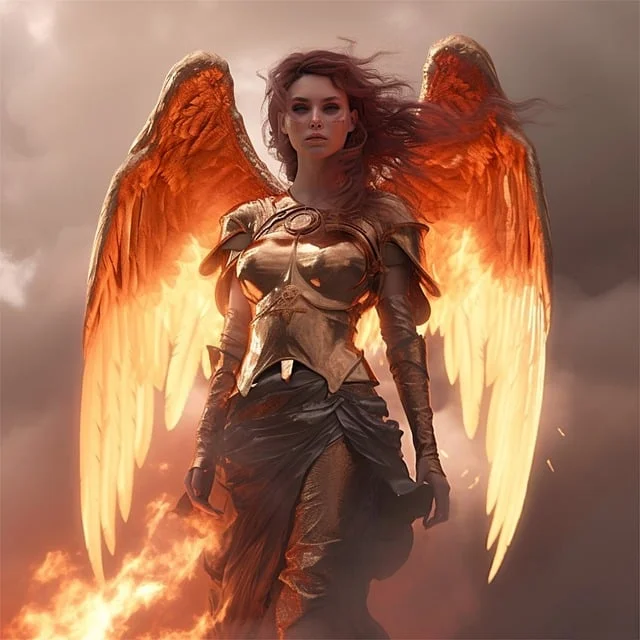
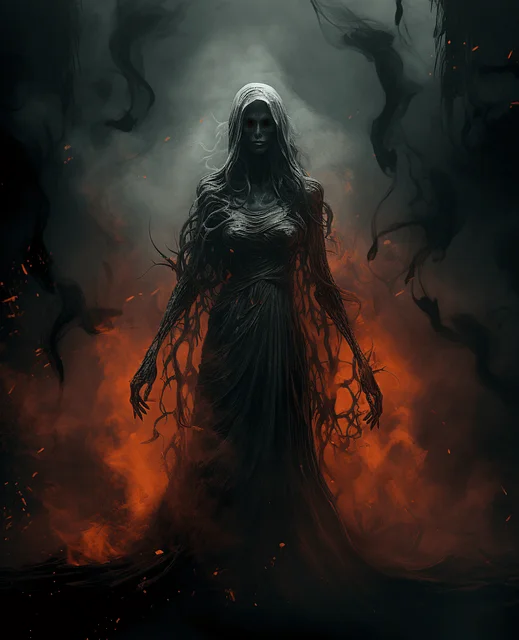

# FANTASY-BATTLE

L'objectif est de réaliser en POO (composition) et type module, un jeu au tour par tour simple.
Le joueur (utilisateur) effectue un clic sur une action (attaquer ou soigner), l'IA contre-attaque .

*En bas de ce fichier, sont fournis HTML et CSS, police d'écriture ainsi qu'une fonction utilitaire permettant de générer un nombre compris entre un minimum et un maximum*

**Il n'y a pas à modifier les fichiers html et css !**

## La structure

Ici je présente les dossiers et quelques fichiers principaux à vous de placer le reste des fichiers aux bons endroits...
```
fantasy-battle
|_assets
    |_css
    |_fonts
    |_img
    |_js
        |_Class
        |_main.js
        |_utils.js
|_index.html
```

## Étapes

On va faire de la composition sur cette exercice, une classe qui est composée d'une autre classe.

Le fichier principal main.js va exécuté une Classe Program.
Cette Classe Program, va définir les instructions importantes du jeu.
Elle va :
- Créer les 2 protagonistes.
- Placer les écouteurs sur les boutons d'actions.
- Mettre à jour l'affichage des statistiques des personnages.
- Déterminer le type d'action à effectuer en fonction du bouton cliqué.
- Faire jouer l'IA après l'action du joueur.
    - il peut également soit attaquer soit se soigner sous condition ou de manière aléatoire
- Vérifier l'état des personnages, si un est mort l'autre est le gagnant et
il faut arrêter l'écoute sur les boutons d'actions

La classe Character va :
- Avoir les statistiques des personnages
- Initialiser au lancement du jeu celles-ci avec une base de nombre + un montant aléatoire
- Effectuer des modifications aux propriétés de l'objet du personnage attaqué ou celui qui va se soigner
- Ajouter dans le DOM les informations liés à l'action (journal de combat)


fonts  -> https://www.dafont.com/old-london.font
images -> https://we.tl/t-PV4tCzTMul

```html
<!DOCTYPE html>
<html lang="en">
	<head>
		<meta charset="UTF-8" />
		<meta name="viewport" content="width=device-width, initial-scale=1.0" />
		<link rel="stylesheet" href="./assets/css/main.css" />
		<title>Fantasy Battle</title>
	</head>
	<body>
		<main>
			<header>
				<h1>Fantasy Battle</h1>
				<div></div><!-- conteneur pour une image de fond-->				
			</header>

			<div class="battle">
				<div id="player">
					<figure>
						
						<figcaption>Seraphina</figcaption>
					</figure>

					<div class="stats">
						<p>Health: <span class="hp">100</span></p>
						<p>Mana: <span class="mp">100</span></p>
						<p>Attack: <span class="attack">100</span></p>
						<p>Heal: <span class="heal">100</span></p>
					</div>
				</div>

				<div id="computer">
					<figure>
						
						<figcaption>Mayzikeen</figcaption>
					</figure>
					<div class="stats">
						<p>Health: <span class="hp">100</span></p>
						<p>Mana: <span class="mp">100</span></p>
						<p>Attack: <span class="attack">100</span></p>
						<p>Heal: <span class="heal">100</span></p>
					</div>
				</div>
			</div>

			<aside>
				<div class="player__actions">
					<button id="attack">Attack</button>
					<button id="heal">Heal</button>
				</div>

				<div class="divider"></div>

				<div class="log">
					<h2>Log</h2>
					<ul id="log"></ul>
				</div>
			</aside>
		</main>

		<footer>
			<p>
				&copy; 2024 - Romain Fournier pour la 3W-Academy - Fantasy
				Battle
			</p>
			<ul>
				License des images :
				<li>
					Image par
					<a
						href="https://pixabay.com/users/ang3law-11692607/?utm_source=link-attribution&utm_medium=referral&utm_campaign=image&utm_content=7877234"
						>Angela</a
					>
					de
					<a
						href="https://pixabay.com//?utm_source=link-attribution&utm_medium=referral&utm_campaign=image&utm_content=7877234"
						>Pixabay</a
					>
				</li>

				<li>
					Image par
					<a
						href="https://pixabay.com/fr/users/grumpybeere-22072131/?utm_source=link-attribution&utm_medium=referral&utm_campaign=image&utm_content=8269764"
						>GrumpyBeere</a
					>
					de
					<a
						href="https://pixabay.com/fr//?utm_source=link-attribution&utm_medium=referral&utm_campaign=image&utm_content=8269764"
						>Pixabay</a
					>
				</li>
				<li>
					Image background générée par Romain Fournier sur
					<a href="https://creator.nightcafe.studio/studio"
						>nightcafe</a
					>
				</li>
			</ul>
		</footer>
		<script type="module" src="./assets/js/main.js"></script>
	</body>
</html>
```

```css
:root {
    --font-old-london: 'OldLondon', serif;
    --font-courier: "Courier New", Courier, monospace;
    --color-white: #fff;
    --color-black: #2f2f2e;
    --color-goldenrod: #daa520;
    --color-crimson: #dc143c;
    --color-grey: #333;
    --color-light-grey: #f0bd96;
    --color-dark-grey: #161616;
    --color-green: #008000;
    --color-blue: #6464ff;
}

@font-face {
    font-family: OldLondon;
    src: url(../fonts/OldLondon.ttf);
}

*,
::before,
::after {
    box-sizing: border-box;
    margin: 0;
    padding: 0;
}

html {
    font-size: 62.5%;
}

html,
body {
    height: 100%;
}

body {
    display: flex;
    flex-direction: column;
    line-height: 1.5;
    background-color: var(--color-black);
    font-family: var(--font-courier);
    font-size: 1.8rem;
    color: var(--color-white);
}

ul {
    list-style: none;
}

li {
    padding-left: 1rem;
    font-weight: bold;
}

li:nth-child(odd) {
    background-color: var(--color-grey);
    color: var(--color-goldenrod);
}

li:nth-child(even) {
    background-color: var(--color-grey);
    color: var(--color-crimson);
}

a {
    display: inline-block;
    color: var(--color-grey);
}

img {
    display: block;
    margin: 0 auto;
    width: 150px;
    height: 150px;
    object-fit: cover;
}

h1,
h2 {
    text-align: center;
    width: 100%;
    font-family: var(--font-old-london);
}

h1,
figcaption::first-letter {
    font-size: 5rem;
	font-family: var(--font-old-london);
}

h2 {
    font-size: 4rem;
    margin: 1rem 0;
}

header div {
    background: url(../img/bcg.webp) no-repeat right 20% / cover;
    transform: scaleX(-1);
    padding: 12rem;
    margin-bottom: 2rem;
}

main {
    position: relative;
    flex-grow: 1;
    min-width: 700px;
    max-width: 700px;
    margin: auto;
}

.battle {
    display: flex;
    flex-wrap: wrap;
    justify-content: space-around;
}

.stats {
    display: flex;
    flex-direction: column;
}

.stats p {
    display: grid;
    grid-template-columns: 1fr 1fr;
}

.stats span {
    text-align: right;
    font-weight: bold;
}

.hp {
    color: var(--color-green);
}

.mp {
    color: var(--color-blue);
}

.divider {
    width: 3px;
}

.log {
    flex-basis: 70%;
    border-left: 1px solid #827f7f;
    background-color: var(--color-dark-grey);
    height: 25rem;
    overflow-y: auto;
}

aside {
    display: flex;
    justify-content: space-between;
    border: 4px double #827f7f;
    margin: 4rem auto;
    border-radius: 0.5rem;
}

.player__actions {
    display: flex;
    flex-direction: column;
    gap: 1rem;
    flex-basis: 30%;
    border-right: 1px solid #827f7f;
    background-color: var(--color-light-grey);
}

aside button {
    text-transform: uppercase;
    border: 0;
    height: 20%;
    background-color: var(--color-light-grey);
    text-align: left;
    padding-left: 2rem;
    font-weight: bold;
}

button:hover {
    color: var(--color-white);
    text-shadow: 0 0 10px #050505;
    cursor: pointer;
}

#player img {
    border-top-right-radius: 20px;
    border-bottom-left-radius: 10px;
    border: 3px solid var(--color-goldenrod);
}

#computer img {
    border-top-left-radius: 20px;
    border-bottom-right-radius: 10px;
    border: 3px solid var(--color-crimson);
}

figcaption {
    text-align: center;
}

.hidden {
    display: none;
}

footer {
    text-align: center;
    padding: 1rem;
    background-color: var(--color-grey);
    color: var(--color-white);
}

footer a {
    color: var(--color-white);
}

```

```js
function getRandomInteger(min, max) {
	return Math.floor(Math.random() * (max - min + 1)) + min;
}

export { getRandomInteger };
```